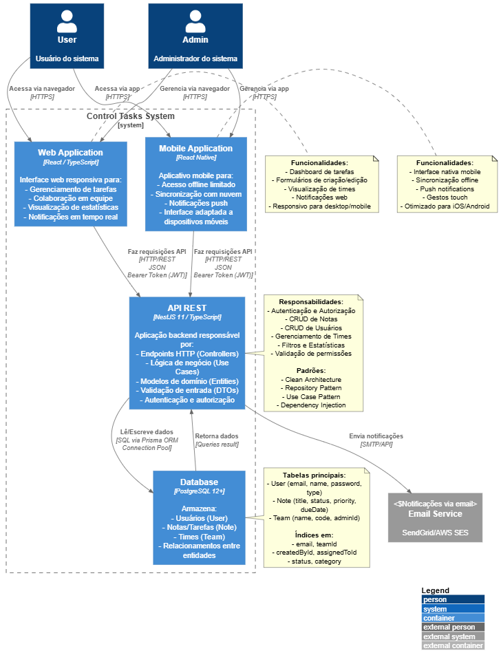
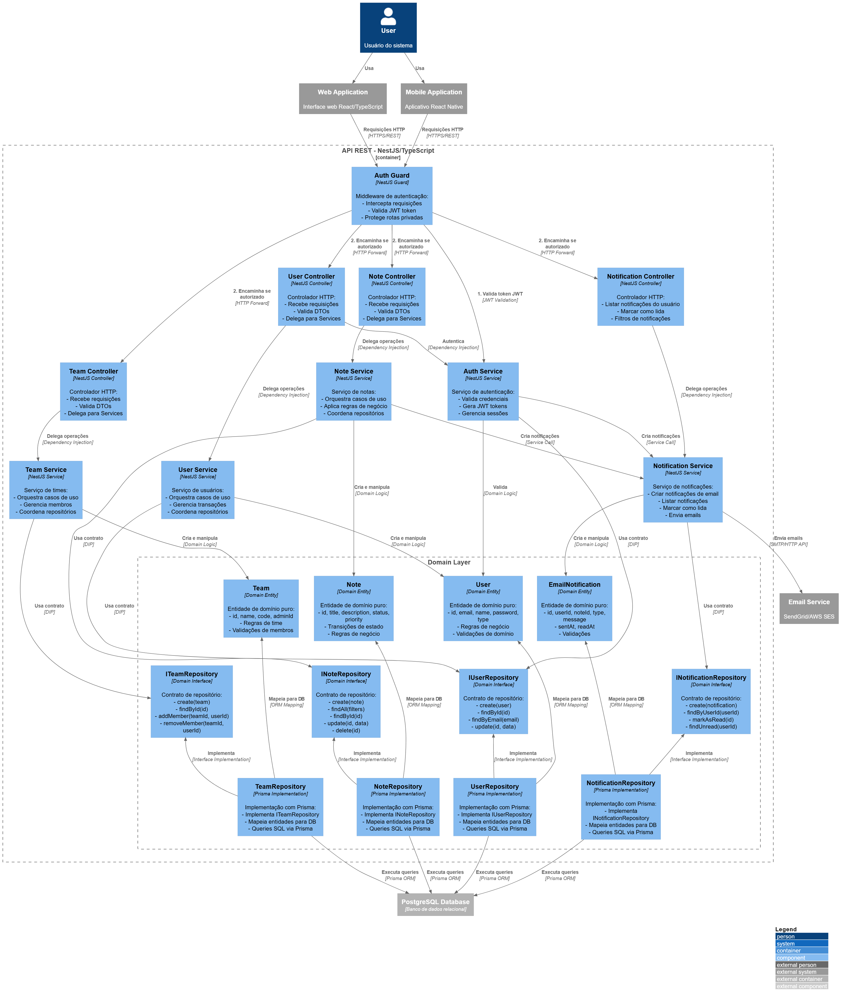
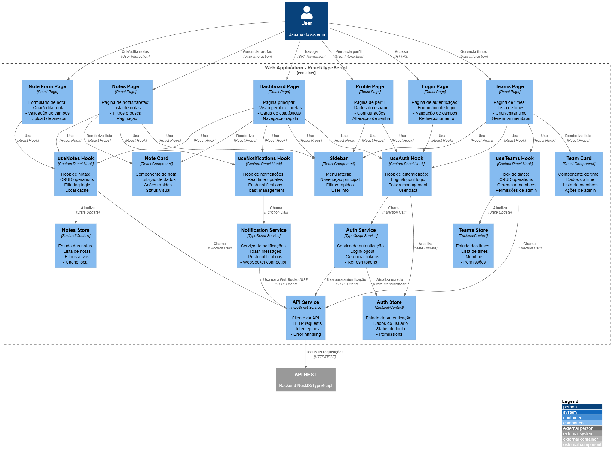
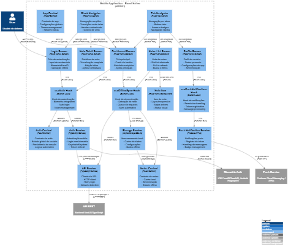

# Control Tasks - Sistema de Gerenciamento de Tarefas e Equipes

## Descrição do Projeto

O **Control Tasks** é um sistema abrangente para gerenciamento de tarefas, notas, equipes, comentários, atividades e notificações. Desenvolvido para suportar usuários em diferentes papéis (Gerente de Equipe, Membro da Equipe, Pessoa Autônoma e Administrador), o sistema oferece acesso multiplataforma via web e mobile, com integrações para notificações por email em tempo real.

## Funcionalidades Principais

- **Gerenciamento de Tarefas/Notas**: Criação, edição, atribuição, prazos e transições de estado.
- **Colaboração em Equipe**: Times com administradores, compartilhamento de tarefas e comentários.
- **Notificações**: Em tempo real via web/mobile e email para eventos importantes.
- **Histórico e Estatísticas**: Registro de atividades e métricas de produtividade.
- **Acesso Multiplataforma**: Interfaces web e mobile com sincronização.
- **Personalização e Exportação**: Interface customizável e exportação de dados.

## Histórias de Usuário

### Gerente de Equipe
- Como gerente de equipe, quero criar e atribuir tarefas para organizar o trabalho do time.
- Como gerente de equipe, quero definir prazos para tarefas para garantir o cumprimento dos objetivos.
- Como gerente de equipe, quero gerar registros de progresso das tarefas para acompanhar o desempenho da equipe.
- Como gerente de equipe, quero criar subtarefas para dividir atividades complexas em etapas menores.
- Como gerente de equipe, quero receber notificações por e-mail sobre eventos importantes para agir rapidamente.
- Como gerente de equipe, quero visualizar o histórico de alterações das tarefas para auditar mudanças e decisões.
- Como gerente de equipe, quero exportar dados do sistema para relatórios ou análises externas.
- Como gerente de equipe, quero personalizar a interface para adaptar o sistema às necessidades do time.
- Como gerente de equipe, quero acessar o sistema pela versão móvel para gerenciar a equipe remotamente.
- Como gerente de equipe, quero acessar um tutorial para aprender a usar todas as funcionalidades.

### Membro da Equipe
- Como membro da equipe, quero editar tarefas em tempo real.
- Como membro da equipe, quero marcar tarefas como concluídas para sinalizar o progresso.
- Como membro da equipe, quero receber notificações por e-mail sobre tarefas atribuídas ou atualizações.
- Como membro da equipe, quero exportar dados do sistema para uso próprio.
- Como membro da equipe, quero personalizar a interface para melhor experiência de uso.
- Como membro da equipe, quero acessar a versão móvel para trabalhar de qualquer lugar.
- Como membro da equipe, quero acessar um tutorial para tirar dúvidas sobre o sistema.

### Pessoa Autônoma
- Como pessoa autônoma, quero marcar tarefas como concluída para controlar meu próprio progresso.
- Como pessoa autônoma, quero exportar dados do sistema para controle pessoal.
- Como pessoa autônoma, quero personalizar a interface conforme minha preferência.
- Como pessoa autônoma, quero acessar a versão móvel para gerenciar tarefas fora do escritório.
- Como pessoa autônoma, quero acessar um tutorial para aprender a usar o sistema.

### Usuário (Funcionalidades comuns a todos)
- Como usuário, quero exportar dados do sistema para análise ou backup.
- Como usuário, quero personalizar a interface para melhor usabilidade.
- Como usuário, quero acessar a versão móvel para utilizar o sistema em diferentes dispositivos.
- Como usuário, quero acessar um tutorial para aprender a usar o sistema.

## Requisitos Funcionais

Principais requisitos funcionais do sistema:

### 1.1 Gerenciamento de Usuários
- RF-01: Criar novo usuário (email, nome, senha, tipo ADMIN/USER).
- RF-02: Autenticar usuário (gerar token JWT).
- RF-03: Obter dados do usuário.
- RF-04: Atualizar perfil (com permissões).

### 1.2 Gerenciamento de Notas/Tarefas
- RF-05: Criar nova nota/tarefa (título, descrição, prioridade, etc.).
- RF-06: Listar todas as notas com filtros (título, status, data, etc.).
- RF-07: Listar notas do usuário.
- RF-08: Obter estatísticas do usuário.
- RF-09: Obter nota específica.
- RF-10: Atualizar nota.
- RF-11: Deletar nota.
- RF-12: Atribuir nota a usuário.
- RF-13: Remover atribuição.

### 1.3 Lógica de Domínio
- RF-14: Transições de estado (PENDING, TODO, IN_PROGRESS, REVIEW, COMPLETED, CANCELLED).
- RF-15: Verificar se nota está vencida.
- RF-16: Verificações de permissão.
- RF-17: Atribuição de nota.

### 1.4 Colaboração em Equipe
- RF-18: Time com administrador.
- RF-19: Notas compartilhadas em time.

### 1.5 Autenticação e Tokens
- RF-20: Geração de API Tokens (JWT).
- RF-21: Revogação automática de token anterior.

## Requisitos Não Funcionais

Organizados conforme ISO/IEC 25010:

### 1. Desempenho e Eficiência
- NF1.1: Tempo de resposta ≤ 2s para 95% das requisições.
- NF1.2: Autenticação rápida (≤1s em 99% dos casos).
- NF1.3: Suporte a 500 usuários simultâneos.
- NF1.4: Sincronização multiplataforma em ≤5s.

### 2. Segurança
- NF2.1: Comunicação segura via HTTPS.
- NF2.2: Hash de senhas com bcrypt (salt ≥10).
- NF2.3: Autenticação JWT com expiração de 24h.
- NF2.4: Proteção contra ataques comuns (SQL injection, XSS, etc.).

### 3. Confiabilidade
- NF3.1: Disponibilidade de 99,5% durante horário comercial.
- NF3.2: Backup diário.
- NF3.3: Recuperação em ≤2h após incidente.

### 4. Usabilidade
- NF4.1: Interface responsiva e consistente (web/mobile).
- NF4.2: Mensagens de erro claras.
- NF4.3: Notificações em tempo real.

### 5. Compatibilidade
- NF5.1: Navegadores modernos (Chrome, Firefox, Edge) e dispositivos (Android 8+, iOS 13+).

### 6. Manutenibilidade
- NF6.1: Código documentado e padrões definidos.
- NF6.2: Cobertura de testes ≥70%.

### 7. Portabilidade
- NF7.1: Implantação em Windows e Linux sem adaptações grandes.

## Casos de Uso

Principais casos de uso do sistema, organizados por pacotes:

### Autenticação e Usuários
- Registrar Novo Usuário
- Autenticar Usuário
- Gerar Token API
- Visualizar Perfil
- Atualizar Perfil Próprio
- Atualizar Perfil Outro (Admin Only)

### Notas e Tarefas
- Criar Nota/Tarefa
- Atribuir Tarefa
- Definir Prazo para Tarefa
- Criar Subtarefas
- Editar Tarefa em Tempo Real
- Marcar Tarefa como Concluída
- Listar Todas as Notas
- Visualizar Nota
- Atualizar Nota
- Deletar Nota
- Remover Atribuição
- Filtrar Notas

### Meus Dados e Estatísticas
- Visualizar Minhas Notas
- Visualizar Minhas Estatísticas

### Colaboração em Equipe
- Criar Equipe
- Convidar Usuário para Equipe
- Gerenciar Membros da Equipe
- Compartilhar Nota no Time
- Visualizar Notas do Time

### Atividades e Histórico
- Registrar Progresso
- Visualizar Histórico de Alterações
- Registrar Atividades (Automático)
- Listar Atividades

### Comentários e Discussão
- Adicionar Comentário
- Listar Comentários

### Notificações
- Receber Notificações por Email
- Criar Notificações (Automático)
- Listar Notificações
- Marcar como Lida

### Funcionalidades Gerais
- Exportar Dados
- Personalizar Interface
- Acessar Versão Móvel
- Acessar Tutorial

### Lógica de Nota
- Transicionar Estado
- Verificar Vencimento
- Validar Permissões

## Diagramas

### Diagrama de Casos de Uso

### Diagrama C4 - Contexto

### Diagrama C4 - Container

## Diagrama C4 de Componentes

### C4 - Component Api

### C4 - Component Web

### C4 - Component Mobile
